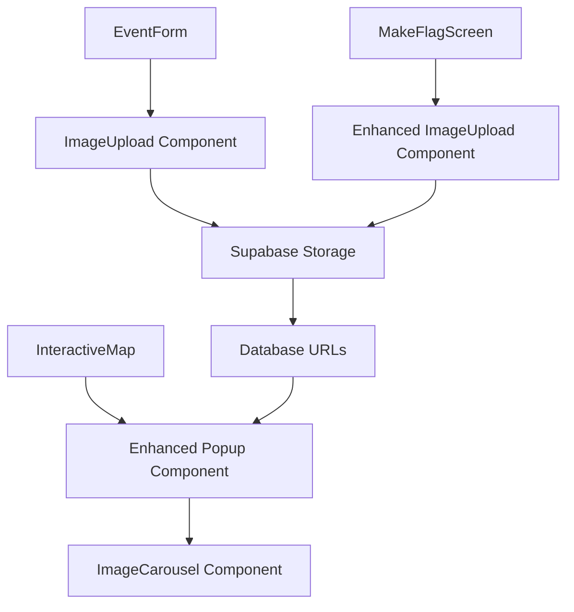

# Design Document

## Overview

The image management feature extends the existing Buzz application to support comprehensive image functionality for both flags and events. The design leverages the existing Supabase storage infrastructure and builds upon current patterns established in the MakeFlagScreen component.

Key capabilities:
- Multiple image uploads for flags (social media post-like experience)
- Single banner image uploads for events
- Image display in map popups with carousel navigation
- Integration with existing storage and API systems

## Architecture

### Storage Layer
The system uses the existing Supabase storage infrastructure with the following organization:

```
media/
├── flags/
│   └── {timestamp}_{random}.{ext}
└── events/
    └── {timestamp}_{random}.{ext}
```

### Data Flow
1. **Upload**: User selects images → Frontend uploads to Supabase → URLs stored in database
2. **Display**: Map loads pins → API returns image URLs → Frontend displays in popups
3. **Navigation**: User interacts with carousel → Frontend manages image switching

### Component Architecture



## Components and Interfaces

### 1. Enhanced ImageUpload Component

**Purpose**: Reusable component for image uploads with different modes (single/multiple)

**Props Interface**:
```typescript
interface ImageUploadProps {
  mode: 'single' | 'multiple'
  maxFiles?: number
  maxSizeBytes?: number
  onImagesChange: (urls: string[]) => void
  initialImages?: string[]
  disabled?: boolean
  acceptTypes?: string
}
```

**Key Features**:
- Drag and drop support
- File validation (type, size)
- Preview functionality
- Progress indicators
- Error handling

### 2. ImageCarousel Component

**Purpose**: Display multiple images with navigation in popups

**Props Interface**:
```typescript
interface ImageCarouselProps {
  images: string[]
  initialIndex?: number
  onImageChange?: (index: number) => void
  className?: string
}
```

**Key Features**:
- Touch/swipe navigation
- Keyboard navigation (arrow keys)
- Thumbnail indicators
- Loading states
- Error fallbacks

### 3. Enhanced Map Popup

**Purpose**: Display flag/event information with integrated image viewing

**Key Features**:
- Conditional image display based on content type
- Carousel integration for multiple images
- Responsive layout
- Loading states

### 4. Storage Service Enhancement

**Purpose**: Extend existing storage utilities for organized uploads

**New Functions**:
```typescript
export const uploadEventImage = async (file: File): Promise<string>
export const uploadFlagImages = async (files: File[]): Promise<string[]>
export const deleteImages = async (urls: string[]): Promise<void>
```

## Data Models

### Database Schema Updates

**Events Table** (existing field):
```sql
event_image_path text -- Single banner image URL
```

**Flags Table** (existing field):
```sql
image_paths text[] -- Array of image URLs
```

### API Response Models

**Enhanced Event Model**:
```typescript
interface Event {
  // ... existing fields
  imagePath?: string // Banner image URL
}
```

**Enhanced Flag Model**:
```typescript
interface Flag {
  // ... existing fields
  imageUrl?: string // Comma-separated URLs (legacy)
  imagePaths?: string[] // Array of image URLs (preferred)
}
```

## Error Handling

### Upload Errors
- **File Size Exceeded**: Display user-friendly message with size limits
- **Invalid File Type**: Show accepted formats
- **Network Failure**: Retry mechanism with exponential backoff
- **Storage Quota**: Graceful degradation with notification

### Display Errors
- **Image Load Failure**: Fallback to placeholder or default icon
- **Network Issues**: Cached images when possible
- **Broken URLs**: Remove from display, log for cleanup

### Validation Rules
- **File Size**: Max 10MB per image
- **File Types**: JPEG, PNG, WebP only
- **Quantity Limits**: Max 10 images per flag, 1 per event
- **Dimensions**: Auto-resize if over 2048px width/height

## Testing Strategy

### Unit Tests
- ImageUpload component file validation
- ImageCarousel navigation logic
- Storage service upload/delete functions
- URL parsing and formatting utilities

### Integration Tests
- End-to-end flag creation with images
- End-to-end event creation with banner
- Map popup image display
- Image carousel navigation

### Visual Tests
- Image upload UI states (empty, loading, error, success)
- Carousel responsive behavior
- Popup layout with/without images
- Mobile touch interactions

### Performance Tests
- Large image upload handling
- Multiple image loading in popups
- Memory usage during carousel navigation
- Network failure recovery

### Accessibility Tests
- Keyboard navigation in carousel
- Screen reader compatibility
- Alt text for images
- Focus management in upload component

## Implementation Notes

### Existing Code Integration
- Leverage existing `uploadMediaFiles` function in `storage.ts`
- Extend current `MakeFlagScreen` image handling
- Build upon `InteractiveMap` popup system
- Maintain compatibility with existing API contracts

### Performance Considerations
- Lazy load images in carousel
- Implement image compression before upload
- Use progressive JPEG for better perceived performance
- Cache uploaded images locally during session

### Mobile Optimization
- Touch-friendly carousel controls
- Responsive image sizing
- Optimized upload for mobile networks
- Gesture support for image navigation