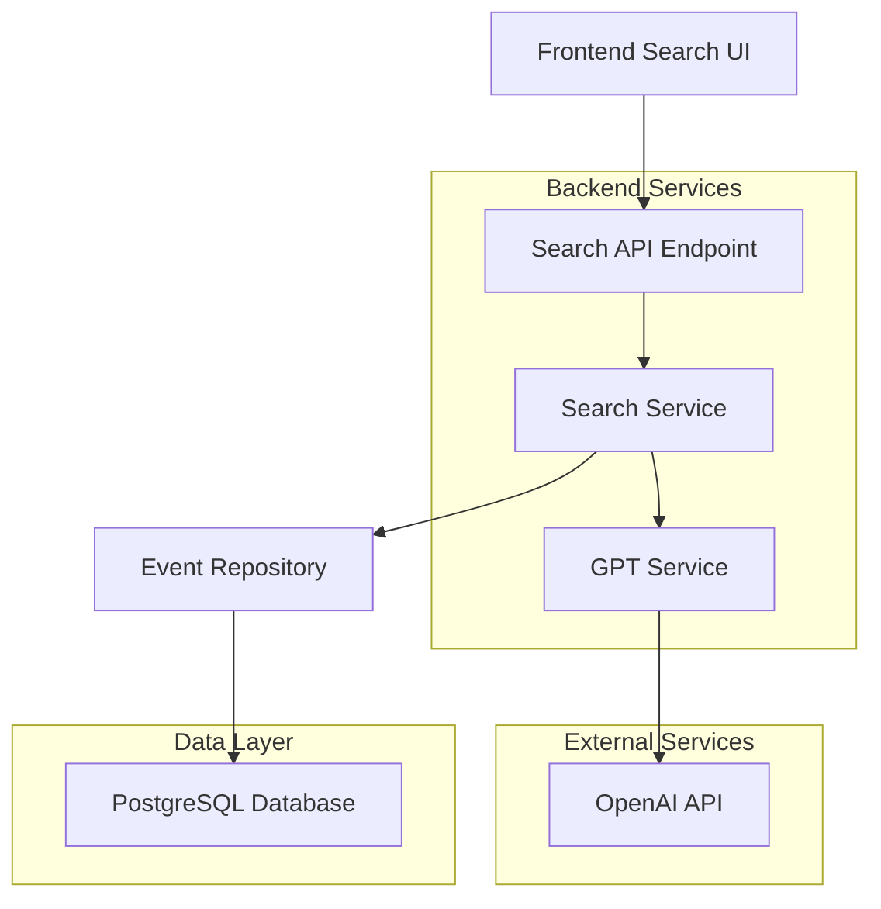

# Design Document

## Overview

The intelligent event search feature enhances the existing event discovery system by integrating GPT-powered semantic analysis. The system will analyze user search queries and event content to determine semantic relevance, providing more accurate and contextually appropriate search results than traditional keyword matching.

The feature integrates with the existing Spring Boot backend and React frontend, adding new API endpoints and UI components while maintaining compatibility with the current event system architecture.

## Architecture

### High-Level Architecture



### Component Integration

The intelligent search system integrates with existing components:

- **EventRepository**: Leverages existing event fetching methods
- **Event API**: Extends current event endpoints with search functionality  
- **Frontend Event Display**: Reuses existing event listing components
- **User Authentication**: Uses existing X-User-Id header system

## Components and Interfaces

### Backend Components

#### 1. SearchController
New REST controller handling search requests:

```java
@RestController
@RequestMapping("/search")
public class SearchController {
    @GetMapping("/events")
    public ResponseEntity<EventsResponse> searchEvents(
        @RequestParam String query,
        @RequestParam double lat,
        @RequestParam double lon,
        @RequestParam(defaultValue = "5.0") double radiusMiles,
        @RequestParam(defaultValue = "20") int limit
    )
}
```

#### 2. SearchService
Core business logic for intelligent search:

```java
@Service
public class SearchService {
    public EventsResponse searchEvents(String query, double lat, double lon, double radiusMiles, int limit);
    private List<Event> filterEventsByRelevance(String query, List<Event> events);
    private boolean isEventRelevant(String query, Event event);
}
```

#### 3. GPTService
Handles OpenAI API integration:

```java
@Service
public class GPTService {
    public boolean isContentRelevant(String query, String eventContent);
    private String buildPrompt(String query, String eventContent);
    private boolean parseRelevanceResponse(String gptResponse);
}
```

#### 4. Configuration
GPT API configuration:

```java
@ConfigurationProperties(prefix = "app.gpt")
public class GPTConfig {
    private String apiKey;
    private String model = "gpt-3.5-turbo";
    private int maxTokens = 150;
    private double temperature = 0.1;
}
```

### Frontend Components

#### 1. SearchBar Component
```typescript
interface SearchBarProps {
  onSearch: (query: string) => void;
  isLoading: boolean;
  placeholder?: string;
}

export const SearchBar: React.FC<SearchBarProps>
```

#### 2. SearchResults Component
```typescript
interface SearchResultsProps {
  events: Event[];
  isLoading: boolean;
  error?: string;
  onLoadMore?: () => void;
}

export const SearchResults: React.FC<SearchResultsProps>
```

#### 3. API Integration
Extension of existing api.ts:

```typescript
export const api = {
  // ... existing methods
  searchEvents: async (
    query: string,
    lat: number,
    lon: number,
    radiusMiles?: number,
    limit?: number
  ): Promise<EventsResponse | null>
}
```

## Data Models

### Search Request Model
```java
public class SearchEventRequest {
    private String query;
    private double lat;
    private double lon;
    private double radiusMiles = 5.0;
    private int limit = 20;
}
```

### GPT Request/Response Models
```java
public class GPTRelevanceRequest {
    private String model;
    private List<GPTMessage> messages;
    private int maxTokens;
    private double temperature;
}

public class GPTRelevanceResponse {
    private List<GPTChoice> choices;
}
```

### Event Content Model
```java
public class EventContent {
    private String title;
    private String description;
    private String category;
    
    public String getCombinedContent() {
        return String.join(" ", title, description, category);
    }
}
```

## Error Handling

### GPT API Error Handling
1. **Rate Limiting**: Implement exponential backoff for rate limit errors
2. **API Failures**: Graceful degradation to keyword search or error message
3. **Timeout Handling**: 10-second timeout with fallback behavior
4. **Invalid Responses**: Parse validation with fallback to exclusion

### Search Error Scenarios
1. **Empty Query**: Return validation error message
2. **No Results**: Return empty results with appropriate message
3. **Location Errors**: Handle invalid coordinates gracefully
4. **Database Errors**: Return appropriate error responses

### Frontend Error States
```typescript
interface SearchState {
  isLoading: boolean;
  error: string | null;
  results: Event[];
  hasSearched: boolean;
}
```

## Testing Strategy

### Unit Tests

#### Backend Tests
1. **SearchService Tests**
   - Query processing logic
   - Event filtering algorithms
   - Error handling scenarios

2. **GPTService Tests**
   - API request formatting
   - Response parsing
   - Error handling and fallbacks

3. **SearchController Tests**
   - Request validation
   - Response formatting
   - Error response handling

#### Frontend Tests
1. **SearchBar Component Tests**
   - Input handling and validation
   - Search submission
   - Loading states

2. **SearchResults Component Tests**
   - Event display formatting
   - Loading and error states
   - Empty results handling

3. **API Integration Tests**
   - Request formatting
   - Response handling
   - Error scenarios

### Integration Tests

1. **End-to-End Search Flow**
   - Complete search workflow from UI to database
   - GPT API integration testing
   - Error scenario testing

2. **Performance Tests**
   - Response time under various loads
   - GPT API rate limiting behavior
   - Database query performance

### GPT Integration Testing

1. **Mock GPT Responses**
   - Test various relevance scenarios
   - Error response handling
   - Edge case responses

2. **GPT API Testing**
   - Real API integration tests
   - Rate limiting behavior
   - Cost monitoring

## Implementation Considerations

### Performance Optimization
1. **Caching Strategy**: Cache GPT responses for identical query-event pairs
2. **Batch Processing**: Process multiple events in single GPT requests when possible
3. **Async Processing**: Use async calls for GPT API to improve response times
4. **Database Optimization**: Leverage existing spatial indexing for location filtering

### Cost Management
1. **Request Optimization**: Minimize token usage in GPT prompts
2. **Rate Limiting**: Implement client-side rate limiting to control costs
3. **Fallback Strategy**: Use keyword search when GPT quota is exceeded
4. **Monitoring**: Track API usage and costs

### Security Considerations
1. **API Key Management**: Store GPT API key securely in environment variables
2. **Input Validation**: Sanitize search queries to prevent injection attacks
3. **Rate Limiting**: Prevent abuse through request rate limiting
4. **User Authentication**: Maintain existing authentication patterns

### Scalability
1. **Horizontal Scaling**: Design stateless services for easy scaling
2. **Database Performance**: Optimize queries for large event datasets
3. **GPT API Limits**: Handle API rate limits gracefully
4. **Caching Layer**: Implement Redis caching for frequently searched terms